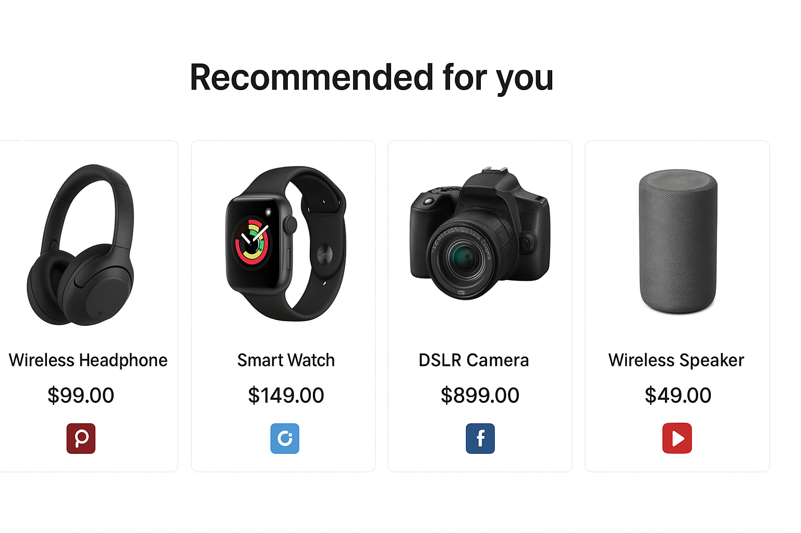

# 🛍️ AI E-commerce Platform (Showcase)

A **next-generation E-commerce solution** that combines a modern shopping experience with **AI-powered product search and recommendations**.  
This repository is for **portfolio showcase only** – it includes **screenshots, sample code snippets, and architecture diagrams**.

---

## 📸 Screenshots & Architecture

### 🔹 Home Page

### 🔹 Product Search & Filters

### 🔹 AI Product Recommendations

### 🔹 System Architecture

---

## ✨ Key Features

- 🖥️ **Modern React Frontend** – Responsive and user-friendly design  
- 🛒 **Cart & Checkout Flow** – Seamless shopping experience  
- 🔍 **Smart Search & Filters** – Quick product discovery with categories and tags  
- 🤖 **AI Recommendations** – Personalized product suggestions using ML models  
- 📊 **Analytics Ready** – Supports customer insights and sales trend tracking  
- ⚡ **Scalable Design** – Modular architecture for growth and integrations  

---

## 🛠️ Tech Stack (Conceptual)

- **Frontend:** React.js, TailwindCSS  
- **Backend:** Node.js, Express, MongoDB  
- **AI Layer:** Product Recommendation Engine (Collaborative Filtering / ML-based search)  
- **Deployment (Conceptual):** Vercel (Frontend), Render/AWS (Backend + AI services)  

---

## 📜 Disclaimer

⚠️ This project is for **showcase/portfolio purposes only**.  
It demonstrates **concepts, architecture, and AI integration** for e-commerce.

---

## 👨‍💻 Authors

By **[Technithunder LABS LLP]**