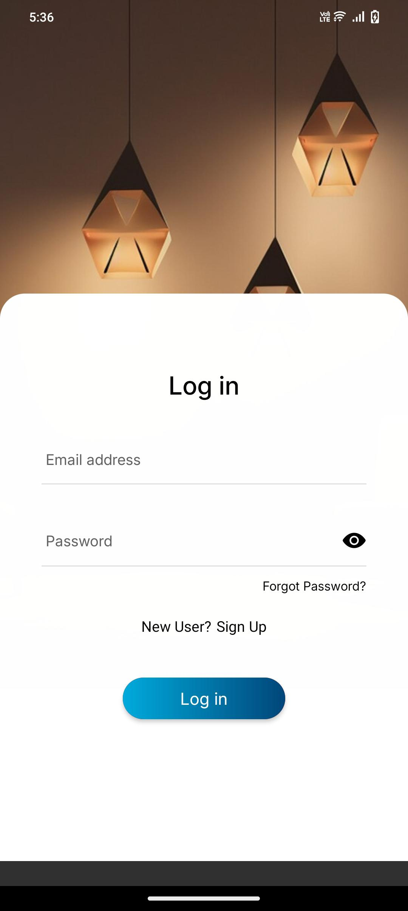
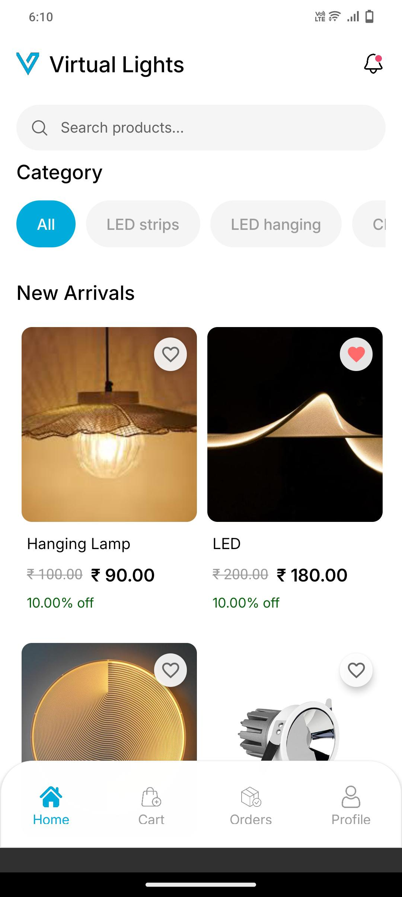
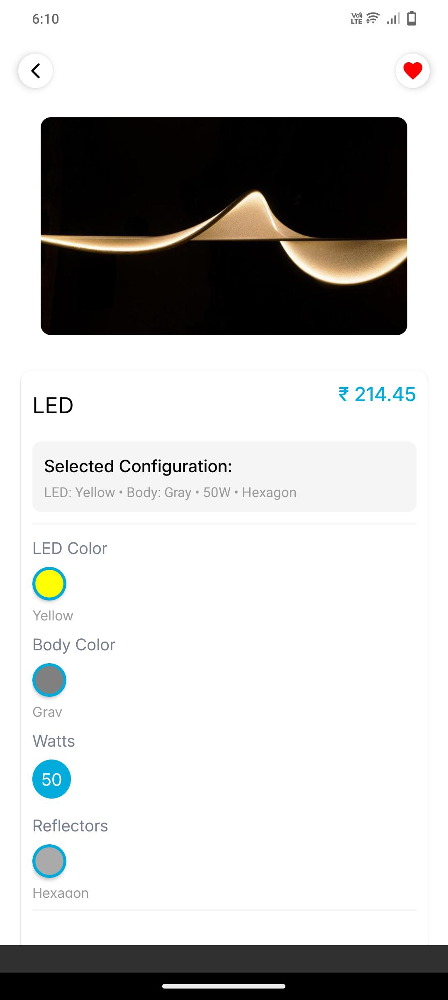
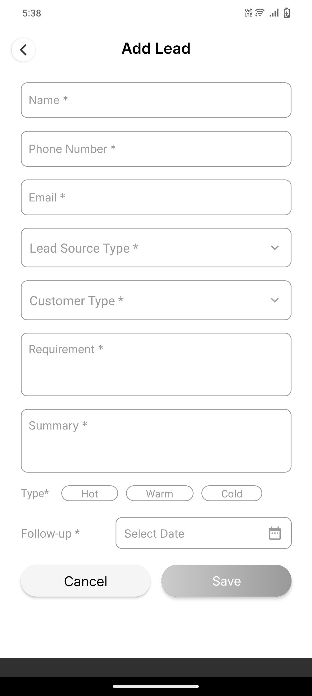
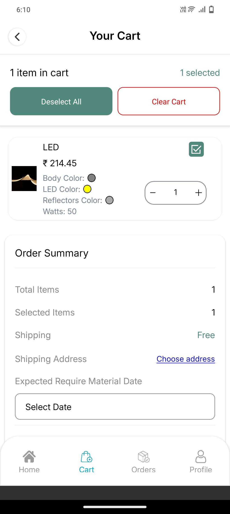
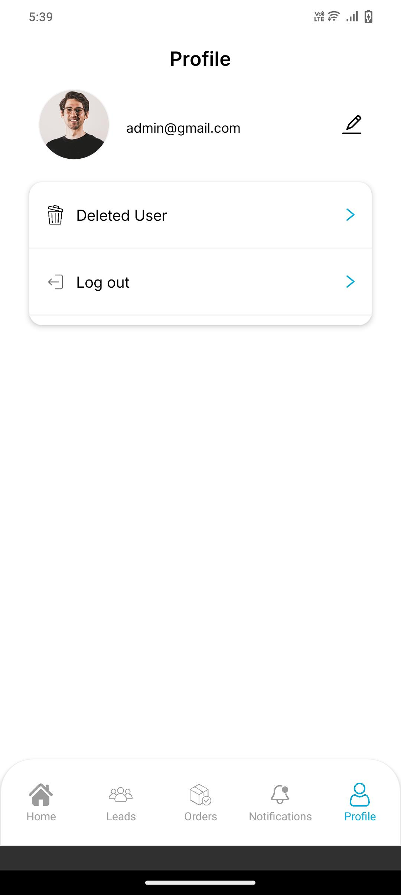

# 📱 Virtual Lights — Mobile App  

A **Virtual Lights Mobile App** built with **React Native**, designed for dealers and sales reps to place and manage orders on the go.  
It allows dealers to browse products, create orders, upload payment screenshots, track order status, and receive real-time updates — all from their mobile device.  

---

## 📸 Screenshots  

  
  
  

  
  
  

---

## ✨ Key Features  

- 👥 **Role-Based Login** – Dealers and Sales Reps with scoped permissions  
- 🛒 **Product Catalog** – Browse available lights (LED, CFL, Floodlights, Panels, Tubelights)  
- 📎 **Dealer Ordering** – Place orders directly from mobile with quantity and product details  
- 📷 **Payment Screenshot Upload** – Attach payment proof while submitting order  
- 📦 **Order Tracking** – Real-time order status updates (Pending → Verified → Dispatched → Delivered)  
- 💳 **Payment Options** – Mark order as COD or attach online payment proof  
- 🔔 **Push Notifications** – Updates for order confirmation, approval, or low stock alerts  
- 🧾 **Invoices & Order History** – View past orders and invoices anytime  
- 📊 **Dealer Dashboard** – Track order counts, pending verifications, and total spend  
- 📞 **Support Access** – Contact admin/sales team directly from the app  

---

## 🛠️ Tech Stack  

- **Framework:** React Native (Expo / CLI)  
- **Backend API:** Node.js + Express  
- **Database:** MongoDB / Mongoose  
- **Authentication:** JWT (with role-based access)  
- **File Storage:** AWS S3 (for payment screenshots & product images)  
- **Notifications:** Firebase Push Notifications  
- **Payments:** Razorpay / Stripe SDK integration (optional)  
- **Deployment:** Play Store (Android) / App Store (iOS)  

---

## 🚀 How It Works  

1. **Login & Roles**  
   - Dealer or Sales Rep logs in with secure credentials.  

2. **Browse Catalog**  
   - Browse lights with details like wattage, color, and stock availability.  

3. **Place Order**  
   - Dealer selects products, adds them to cart, uploads payment screenshot (if prepaid), and submits order.  

4. **Payment Proof & Verification**  
   - Payment screenshot securely uploaded to server (AWS S3).  
   - Admin/Manager reviews payment and order status is updated.  

5. **Order Tracking**  
   - Dealer receives push notifications for every status change: pending, verified, dispatched, delivered.  

6. **Invoices & History**  
   - Dealers can view invoices, download receipts, and track previous orders anytime.  

---

## 📜 Disclaimer  

⚠️ This project is for **portfolio/demo purposes**.  
It demonstrates **mobile workflows for dealers, role-based access, order creation with payment screenshot uploads, and order tracking features**, but may require enhancements for production (security, scaling, compliance).  

---

## 👨‍💻 Author  

By **[Technithunder LABS LLP]**
