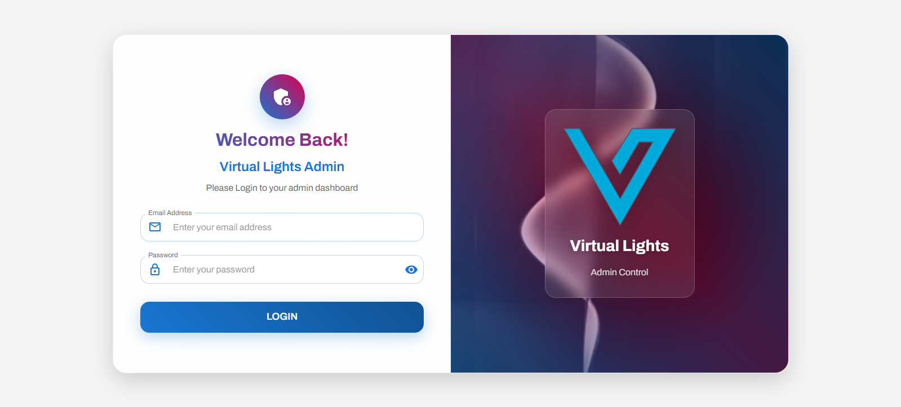
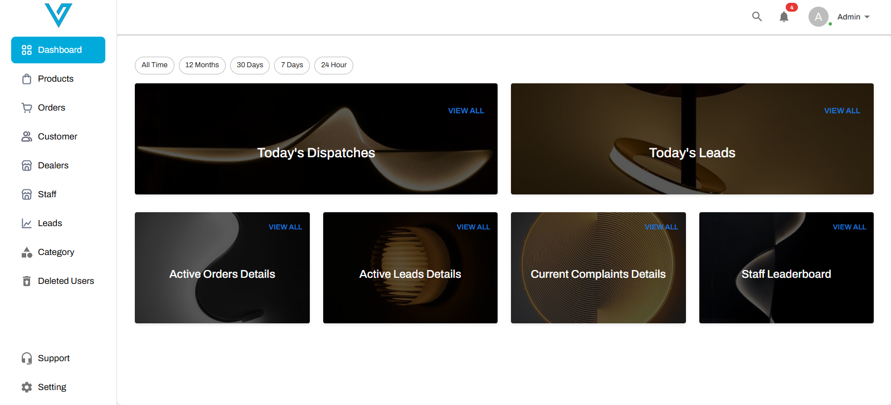
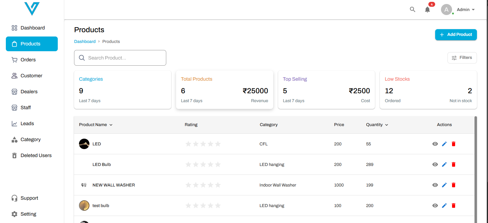
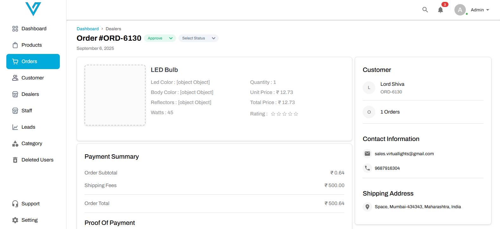
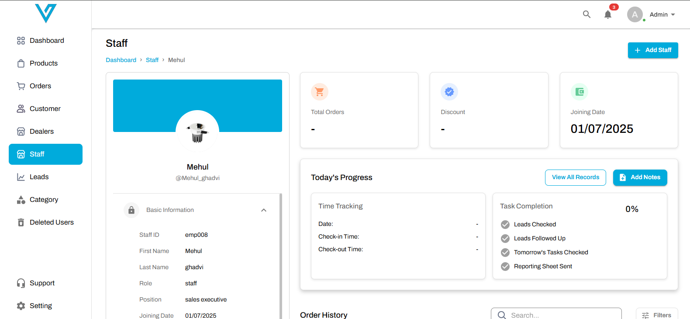
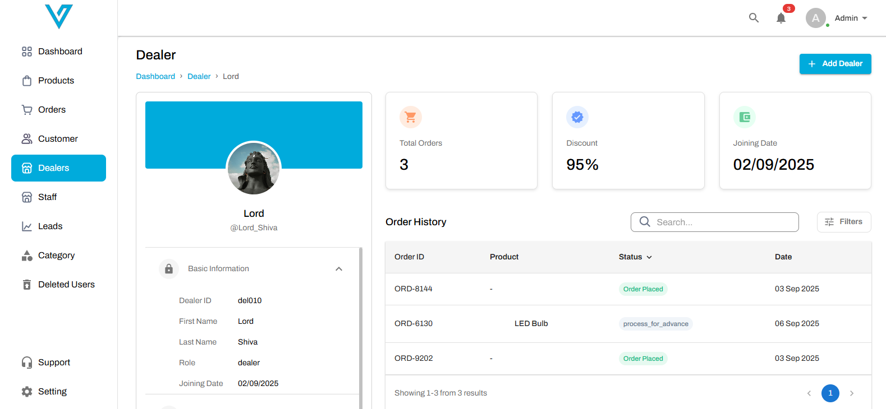

# 💡 Virtual Lights — Admin Panel

A **Virtual Lights Admin Panel** — a comprehensive admin dashboard for a lighting company that sells LED lights and all types of lighting solutions.  
This project provides role-based access (Admin, Manager, Dealer, Sales Rep), inventory & order management, dealer ordering, payment screenshot attachments, reporting, and multi-user workflows designed to streamline operations.

---

## 📸 Screenshots  

  
  
  

  
  
  

---

## ✨ Key Features  

- 👥 **Role-Based Access** – Admin, Manager, Dealer, Sales Rep with scoped permissions  
- 🛒 **Dealer Ordering** – Dealers can place orders for lights, choose payment method and attach payment screenshots  
- 📎 **Payment Screenshot Attachment** – Dealers upload proof of payment (image upload) with orders  
- 📦 **Inventory Management** – Add / update / track stock levels for different light types (LED, CFL, Floodlights, Panels, Tubelights)  
- 💳 **Order Payment Workflow** – Order creation → attach payment proof → manager/admin verification → order approval & dispatch  
- 🧾 **Invoices & Order History** – Generate invoices, view past orders, export CSV/PDF reports  
- 📊 **Reports & Analytics** – Sales by product, dealer performance, stock alerts, revenue dashboards  
- 🔔 **Notifications** – Email / in-app notifications for order status updates and low-stock alerts  
- 🔐 **Admin Controls** – Manage users, roles, permissions, product catalog, and global settings  
- 🔄 **Return & Refund Management** – Handle returns, refunds and dispute resolution workflows  
- 🗂️ **Product Catalog** – Categorize products with variants (wattage, color temperature, lumen, SKU)

---

## 🛠️ Tech Stack  

- **Admin Frontend:** Next.js (React)  
- **Backend:** Node.js + Express  
- **Database:** MongoDB / Mongoose  
- **Authentication:** JWT / Role-based middleware  
- **File Storage:** AWS S3 (for payment screenshots & product images)  
- **Notifications:** Nodemailer (email) / optional WhatsApp integration  
- **Reporting / Exports:** Server-side CSV / PDF generation (e.g., pdfkit, json2csv)  
- **Hosting / Deployment:** Vercel (frontend) / AWS EC2 or Heroku (backend)  

---
## 🚀 How It Works

1. **User & Roles**
   - Admin creates users and assigns roles (Manager, Dealer, Sales Rep).
   - Each role has permissions (view/orders/inventory/approve).

2. **Product & Inventory**
   - Admin/Manager add products to the catalog with SKU, variants, price, and stock count.
   - Inventory updates on order placement, returns, or manual stock adjustments.

3. **Dealer Ordering Flow**
   - Dealer logs in (or via Sales Rep) → browses product catalog → adds items to cart → places order.
   - Dealer uploads **payment screenshot** as proof of payment while placing order (or marks as COD).
   - Order lands in Manager/Admin queue for verification.

4. **Order Verification & Processing**
   - Manager/Admin reviews payment screenshot and order details.
   - On approval, system updates inventory, generates invoice, and notifies dealer.
   - Dispatch / shipping details recorded and order moves to completed state.

5. **Payments & Attachments**
   - Payment proofs are stored securely (S3) with order metadata in DB.
   - Admin can accept/reject payment proofs and request re-submission.

6. **Reporting & Alerts**
   - System generates sales reports, dealer performance metrics, and low-stock alerts.
   - Export reports in CSV/PDF for accounting and analysis.

---

## 📜 Disclaimer

⚠️ This project is for **portfolio/demo purposes**.  
It demonstrates **admin workflows, role-based access, inventory & order management, and payment-attachment features**, but may require additional hardening for a production environment (security audits, rate limiting, input validation, backups, compliance).

---

## 👨‍💻 Author

By **[Technithunder LABS LLP]**
