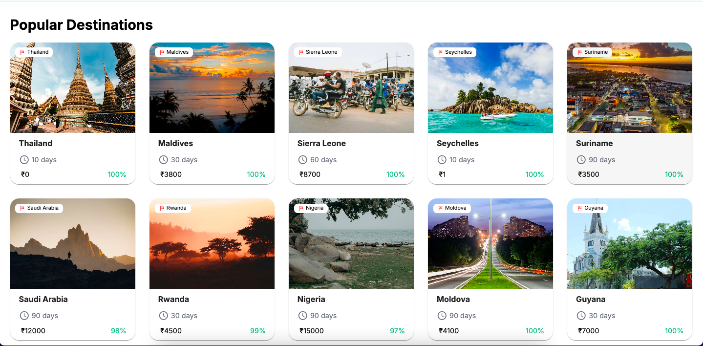
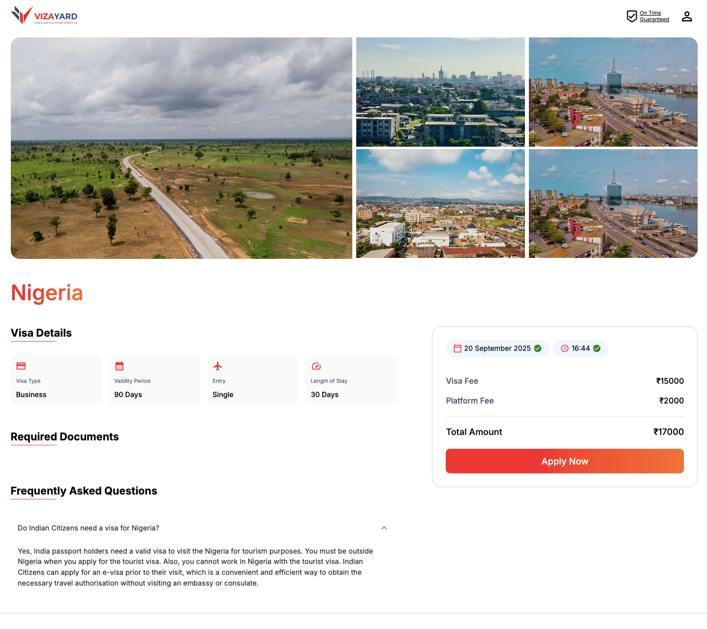

# 🌍 Visa Application Platform

An intelligent **Visa Application System** that simplifies the process of applying for visas.  
It includes features like **WhatsApp notifications, passport validation, AI-powered text extraction, payment gateway integration, and real-time application tracking**.

---

## 📸 Screenshots

---

## ✨ Key Features

- 🔍 **Visa Search** – Quickly search for available visas by country/type  
- 📲 **WhatsApp Notifications** – Notify users: *“You are looking for this country visa”*  
- 🛂 **Passport Validation** – Validate passport details before submission  
- 🤖 **AI Text Extraction (AWS Textract)** – Extract key information directly from passport scans  
- 👥 **Group Visa Application** – Apply for multiple applicants together  
- 💼 **Business Visa Support** – Specialized flow for business visa seekers  
- 🏢 **Agent Booking** – Book visa agents to handle your case  
- 📞 **Call Scheduling** – Schedule a consultation call for visa assistance  
- 💳 **Payment Gateway Integration** – Secure online payments for application fees  
- 📊 **Application Tracking** – Real-time progress tracking of your visa application  

---

## 🛠️ Tech Stack

- **Frontend:** React.js / Next.js (UI)  
- **Backend:** Node.js + Express  
- **Database:** MongoDB  
- **Cloud Services:** AWS Textract (passport OCR & text extraction)  
- **Messaging:** WhatsApp API (notifications)  
- **Payments:** Payment Gateway Integration (Razorpay / Stripe, etc.)  

---

## 🚀 How It Works

1. User searches for a visa by **country/type**  
2. System sends a **WhatsApp notification** confirming their interest  
3. User uploads their **passport** → validated and processed using **AWS Textract**  
4. User selects **visa type** (Group, Business, Individual)  
5. Optional: **Book an agent** or **schedule a call** for guidance  
6. Make a **secure payment** via integrated payment gateway  
7. Track **real-time application progress** from dashboard  

---

## 📜 Disclaimer

⚠️ This project is for **portfolio/showcase purposes only**.  
It demonstrates **concepts, architecture, and visa process automation** but may not be a production-ready application.

---

## 👨‍💻 Author

By **[Technithunder LABS LLP]**

