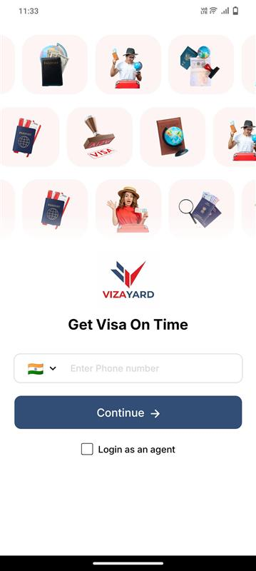
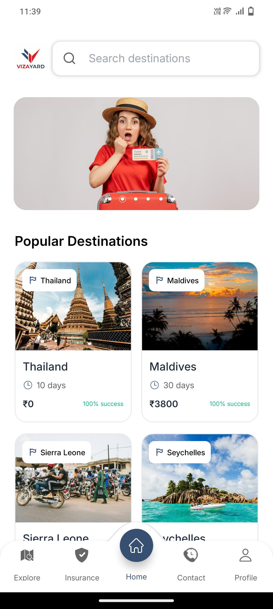
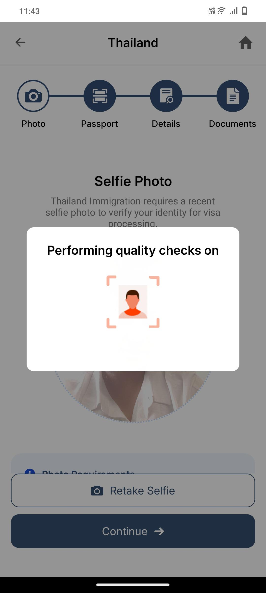
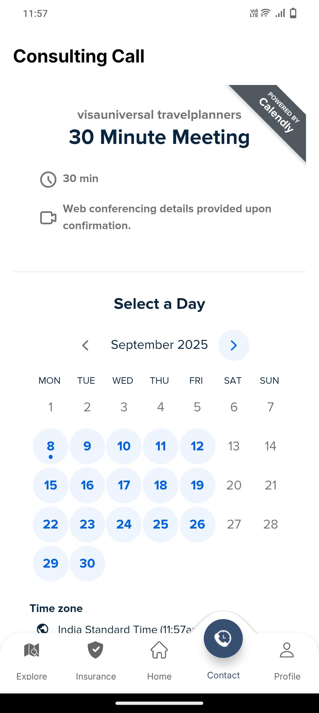
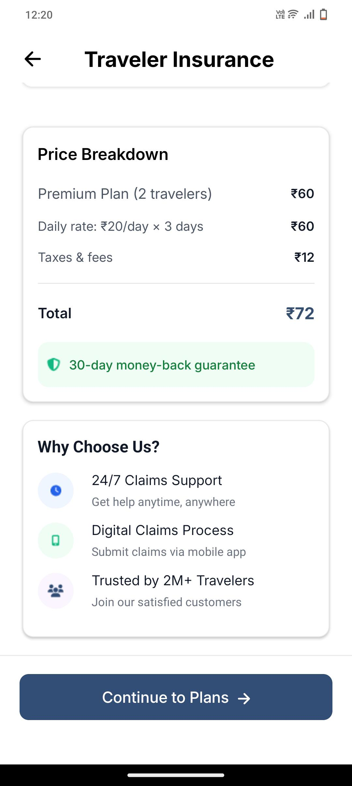
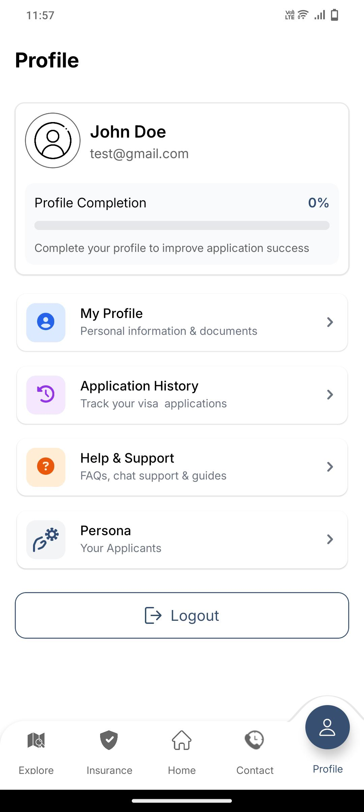

# 📱 Visayard Mobile App  

An intelligent **Visa Application Mobile App** built with **React Native**, designed to simplify and digitize the process of applying for visas on the go.  
It includes features like **push notifications, passport scanning, AI-powered text extraction, payment gateway integration, and real-time application tracking**.  

---

## 📸 Screenshots  

  
  
  

  
  
  

---

## ✨ Key Features  

- 🔍 **Visa Search** – Quickly search for available visas by country/type  
- 🔔 **Push Notifications** – Get instant updates on application status  
- 📷 **Passport Scanning** – Scan and validate passport details directly from the phone camera  
- 🤖 **AI Text Extraction (AWS Textract)** – Extract details from scanned passports instantly  
- 👥 **Group Visa Application** – Apply for multiple applicants from a single device  
- 💼 **Business Visa Support** – Specialized flow for business applicants  
- 🏢 **Agent Booking** – Book visa agents via the mobile app  
- 📞 **Call Scheduling** – Schedule a consultation call with experts  
- 💳 **In-App Payments** – Secure payments with Razorpay/Stripe integration  
- 📊 **Application Tracking** – Real-time application progress with mobile-friendly dashboard  

---

## 🛠️ Tech Stack  

- **Framework:** React Native (Expo / CLI)  
- **Backend API:** Node.js + Express  
- **Database:** MongoDB  
- **Cloud Services:** AWS Textract (passport OCR & text extraction)  
- **Messaging:** Firebase Push Notifications / WhatsApp API  
- **Payments:** Razorpay / Stripe (mobile SDK integration)  

---
## 🚀 How It Works

1. User searches for a visa by **country/type**  
2. System sends a **WhatsApp notification** confirming their interest  
3. User uploads their **passport** → validated and processed using **AWS Textract**  
4. User selects **visa type** (Group, Business, Individual)  
5. Optional: **Book an agent** or **schedule a call** for guidance  
6. Make a **secure payment** via integrated payment gateway  
7. Track **real-time application progress** from dashboard  

---

## 📜 Disclaimer

⚠️ This project is for **portfolio/showcase purposes only**.  
It demonstrates **concepts, architecture, and visa process automation** but may not be a production-ready application.

---

## 👨‍💻 Author

By **[Technithunder LABS LLP]**

